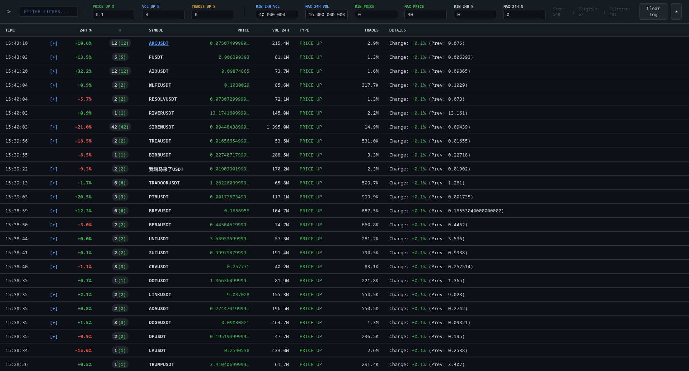

# Binance Futures Monitor

A lightweight real-time monitor for Binance **USDT-M Futures** that consumes the `!ticker@arr` stream via WebSocket, applies configurable filters, and generates trading signals (events) in the browser UI.

## Donations

If you find this tool useful, consider supporting development:

- **BTC**: `bc1pkrvjfucm48l2pe29u75z7z3tk4j62e59p9vacceqt74nv2kkz9aqs39gqj`
- **ETH/BNB/USDT**: `0x2fB1307c3DaC707C81e0441D93202C93521dcF13`
- **TRX/USDT**: `TU18QmJXVNQVSJXEfaD31WDkmrnbVSoerk`
- **SOL**: `B3EKwDFkkg1fknxz57NfFq2pZ9Hh1pzTJ5vqptK4xizr`
- **TON/USDT**: `UQDQV2JLOnUBpfo877TCQNJ08YUR5aNPuBagKyMEVjeT5nLG`


## Features

### Real-time data (WebSocket)

- Streams all USDT-M futures tickers using Binance WebSocket.

### Signal generation

Signals are generated per-symbol based on the tick stream:

- **PRICE UP**
  - Tracks an anchor price per symbol.
  - If price increases by `Price Up %` (threshold), emits one or more incremental signals.
  - Large jumps can generate multiple signals (step-based).

- **VOLUME UP**
  - Tracks a 24h quote-volume anchor (`q`).
  - If 24h quote volume increases by `Vol Up %`, emits a signal.

- **TRADES UP**
  - Tracks a 24h trades count anchor (`n`).
  - If trades count increases by `Trades Up %`, emits a signal.

### UI dashboard

- Real-time table of signals with grouping by symbol.
- Expand/collapse signal history per symbol.
- Live filtering by ticker.
- Sorting (3-state) for:
  - **24h %** (off → desc → asc)
  - **#** (signal count) (off → desc → asc)
  - **Vol 24h** (off → desc → asc)
  - **Trades** (off → desc → asc)

### Monitor / Ignore lists

- **Monitor list**: if non-empty, only these symbols are processed.
- **Ignore list**: always excluded.
- Lists are persisted to `binance_config.json`.

### “Clear Log” (new session)

The **Clear Log** button:

- Clears UI history (`signals` array in the browser).
- Clears backend in-memory `signal_history`.
- Resets pump counters (`PRICE UP` counters) in memory.
- Resets stats counters (seen/eligible sets).
- Appends a session separator row to the CSV.

**Important**: this does **not** reconnect the WebSocket.

### Stats indicator

The header shows WebSocket-based stats:

- **Seen**: symbols observed from the WS stream (after basic symbol sanity filtering).
- **Eligible**: symbols that passed your filters (volume/price/24h%).
- **Filtered**: `Seen - Eligible`.

## Filters & parameters

All filters follow the rule:

- **`0` means “filter disabled”** (no limit).

The following parameters are available in the header form.

### Thresholds (signal triggers)

- **Price Up %** (`PRICE_CHANGE_THRESHOLD`)
  - Example: `0.1` emits PRICE UP signals in 0.1% steps.
  - `0` disables PRICE UP signals.

- **Vol Up %** (`VOLUME_BURST_THRESHOLD`)
  - Percentage growth of 24h quote-volume (`q`).
  - `0` disables VOLUME UP signals.

- **Trades Up %** (`TRADES_CHANGE_THRESHOLD`)
  - Percentage growth of 24h trades count (`n`).
  - `0` disables TRADES UP signals.

### Volume filters (24h quote volume, USD)

- **Min 24h Vol** (`MIN_VOLUME_24H`)
  - `0` disables.
  - Example: `10_000_000` means only symbols with 24h quote volume ≥ $10M.

- **Max 24h Vol** (`MAX_VOLUME_24H`)
  - `0` disables.

### Price filters

- **Min Price** (`MIN_PRICE`)
  - `0` disables.

- **Max Price** (`MAX_PRICE`)
  - `0` disables.

### 24h % change filters

- **Min 24h %** (`MIN_24H_CHANGE`)
  - Negative values down to `-99`.
  - `0` disables.

- **Max 24h %** (`MAX_24H_CHANGE`)
  - `0` disables.
  - Supports large positive values (e.g. 1000%+).

## Data persistence

This app writes two files next to `binance_futures.py`:

- `binance_config.json`
  - Monitor/Ignore lists.
  - Created automatically on first run.

- `binance_data_YYYY-MM-DD.csv`
  - Signal log.
  - A “New session” marker is appended when you press **Clear Log**.

## Requirements

- Python 3.9+ recommended
- Packages:
  - `flask`
  - `flask-socketio`
  - `unicorn-binance-websocket-api`

## Installation

### 1) Create a virtual environment

Linux / macOS:

```bash
python -m venv venv
source .venv/bin/activate
```

Windows (PowerShell):

```powershell
python -m venv .venv
.\.venv\Scripts\Activate.ps1
```

### 2) Install dependencies

```bash
pip install -r requirements.txt
```

(Optional) freeze them:

```bash
pip freeze > requirements.txt
```

## Run

From the project folder:

```bash
python binance_futures.py
```

Then open:

- http://127.0.0.1:5000

To access from another device on your LAN, use:

- http://<your-ip>:5000

**Note**: Ensure port 5000 is open in your firewall if accessing from another device.

## Usage tips

- **First signals delay**: since this is WebSocket-only, signals begin after the first WS ticker updates are received.
- **If no signals**:
  - Ensure your filters are not too strict.
  - Remember: `0` disables a filter.
  - If `Price Up %` is `0`, PRICE UP is disabled.
- **Sorting priority**:
  - If multiple sorts are enabled, the code currently prioritizes in this order:
    `#` → `Vol 24h` → `Trades` → `24h %` → time.

## Example configurations

### High-liquidity focus
```
Min 24h Vol: 50_000_000
Max 24h Vol: 0
Min Price: 0
Max Price: 0
Min 24h %: -5
Max 24h %: 0
Price Up %: 0.1
Vol Up %: 0.5
Trades Up %: 0.5
```

### Low-cap / potential pumps
```
Min 24h Vol: 5_000_000
Max 24h Vol: 200_000_000
Min Price: 0
Max Price: 2
Min 24h %: -10
Max 24h %: 0
Price Up %: 0.2
Vol Up %: 1
Trades Up %: 1
```

## Project structure

```
github/
├── binance_futures.py      # Main Flask app + WebSocket logic
├── requirements.txt         # Python dependencies
├── README.md               # This file
├── github.png              # Screenshot
├── binance_config.json     # Monitor/Ignore lists (auto-created)
└── templates/
    └── index_binance.html   # UI template (Alpine.js)
```

## Troubleshooting

### No signals appear
- Check that at least one signal threshold (`Price Up %`, `Vol Up %`, `Trades Up %`) is > 0.
- Verify filters: `0` means disabled. If `Min 24h Vol` is too high, symbols may be filtered out.
- Wait 10–30 seconds after start for WebSocket data to arrive.

### Connection issues
- Ensure port 5000 is not blocked by firewall.
- If accessing from another device, use your LAN IP (not 127.0.0.1).
- Binance WebSocket limits: max 5 connections per IP. Avoid running multiple instances.

### Files not created
- `binance_config.json` appears after you add symbols to Monitor/Ignore lists.
- `binance_data_YYYY-MM-DD.csv` appears after the first signal is generated.

## Disclaimer

Use at your own risk.
No warranty provided.
